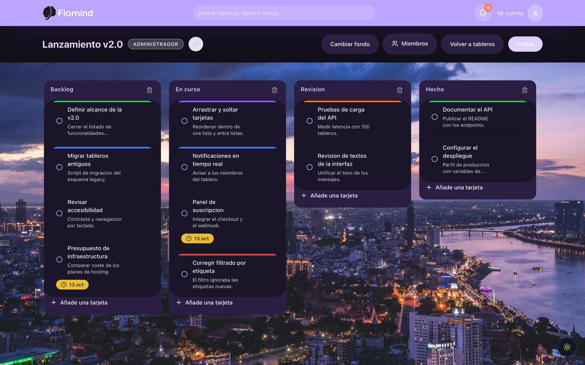
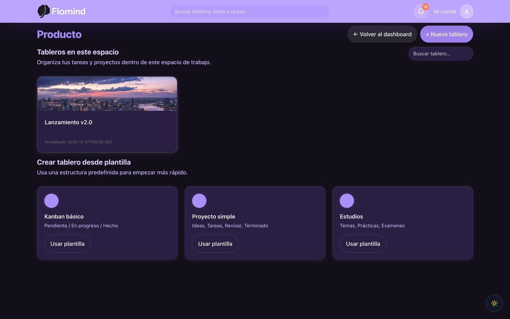

# Flomind

Flomind is a Trello-style kanban web app: workspaces, boards, lists, cards, labels, members and due dates, in
an interface that ships with a full dark theme. It is a two-part project — a Spring Boot REST API backed by
MySQL and a React single-page app — with the UI copy, the database tables and the API paths written in Spanish.

The board is the heart of it. Lists and cards are reordered with pointer drag & drop, a card can carry a colour
label and a due-date badge, and every change fans out in-app notifications to the members of the board.

<p>
  
  
  
  
  
</p>



## Highlights

- **Kanban board with real pointer drag & drop.** Lists reorder horizontally and cards move within and across lists through `@dnd-kit`, with a custom collision-detection strategy and a live `DragOverlay` (`web-trello/src/pages/BoardPage.jsx`).
- **Workspaces that group boards.** Create a space, open it to see the boards inside, and start a board from one of three ready-made templates.
- **A role for every member.** Boards distinguish the owner from `editor` and `lector`, the owner cannot be removed, and a reader gets a clean read-only board with drag and editing switched off.
- **Email invitations with a role and a 7-day token.** Invitations carry a status (`PENDIENTE`/`ACEPTADA`/`RECHAZADA`), and accepting one links the user to the board (`api-trello/src/main/java/com/medac/trello/api/service/InvitationService.java`).
- **Due dates that look after themselves.** Each card shows a date badge that changes appearance as the deadline approaches, and overdue cards are gathered into a `Pendientes` list automatically when the board loads.
- **Notifications for every change.** Creating, updating or deleting a card or a list writes one notification per board member, read back by the bell in the header (`GET /notificaciones`).
- **Colour labels per board.** A label editor with a native colour picker, and five labels seeded on a new board so you can start tagging immediately.
- **Dark mode and photographic backgrounds.** A persisted theme toggle plus five board backgrounds: one solid brand colour and four photos.
- **JWT sessions with BCrypt password hashing**, and a Google OAuth2 client registration configured in the security chain.

## Project structure

```
Flomind/
├── api-trello/     Spring Boot 3.2 REST API — Java 21, MySQL, JWT, Stripe, Gmail SMTP
│   └── src/main/resources/database/{schema.sql,migrations.sql}
├── web-trello/     React 18 + Vite SPA — Tailwind v4, dnd-kit, react-router, framer-motion
├── demo/           Early Spring Boot CRUD prototype kept for history
└── package.json    Root manifest (React deps only, no scripts)
```

## Quick start

Requirements: **JDK 21**, **Maven 3.9+**, **Node.js 20.19+ or 22.12+** and a **MySQL 8** server. Docker is the
quickest way to get MySQL; nothing else in the project needs it.

```bash
# 1 — clone
git clone https://github.com/SergioLorenteDev/Flomind.git && cd Flomind

# 2 — MySQL 8 on :3306 with a `trello` database and an empty root password,
#     matching the defaults already in application.yaml
docker run -d --name flomind-mysql \
  -e MYSQL_ALLOW_EMPTY_PASSWORD=yes -e MYSQL_DATABASE=trello \
  -p 3306:3306 mysql:8.0

# 3 — create the tables
{ echo 'SET FOREIGN_KEY_CHECKS=0;'; cat api-trello/src/main/resources/database/schema.sql; } \
  | docker exec -i flomind-mysql mysql -uroot trello
```

Then bring up the two halves, one per terminal:

```bash
# 4 — credentials for the API (git-ignored .env) and start it on http://localhost:8080/trello/v1
cd api-trello
cp example.env .env
printf 'JWT_SECRET_KEY=%s\n' "$(openssl rand -base64 64 | tr -d '\n')" >> .env
mvn spring-boot:run
```

```bash
# 5 — SPA on http://localhost:3000
cd web-trello && npm install && npm run dev
```

Open <http://localhost:3000> and create an account from **Regístrate**. Registration sends a confirmation email;
while you are working locally you can complete the same confirmation straight from the token the API stored:

```bash
TOKEN=$(docker exec flomind-mysql mysql -uroot trello -N \
  -e "SELECT confirmation_token FROM usuario WHERE email='you@example.com';")
curl "http://localhost:8080/trello/v1/auth/confirm?token=$TOKEN"
```

Once confirmed, sign in and create your first workspace, board and list.

## Configuration

Credentials live in `api-trello/.env`. Spring Boot loads that file automatically
(`spring.config.import: optional:file:.env[.properties]` in `application.yaml`) and git ignores it, so your values
stay out of the repository. `api-trello/example.env` is the committed template:

```bash
cd api-trello && cp example.env .env
printf 'JWT_SECRET_KEY=%s\n' "$(openssl rand -base64 64 | tr -d '\n')" >> .env
```

| Variable | Required | Notes |
| --- | --- | --- |
| `JWT_SECRET_KEY` | yes | Base64 signing key for the JWT sessions. Generate it with `openssl rand -base64 64`. |
| `BASE_URL` | yes | Public base URL of the API. `http://localhost:8080` locally. |
| `GOOGLE_CLIENT_ID`, `GOOGLE_CLIENT_SECRET` | yes | Google OAuth2 client. `example.env` ships obvious placeholders so the app boots out of the box; replace them with your own to use Google sign-in. |
| `STRIPE_SECRET_KEY` | yes | Stripe API key, read by the subscription endpoints. |
| `MYSQL_PASSWORD` | no | Password for the `root` user at `localhost:3306/trello`. Empty by default. |
| `STRIPE_WEBHOOK_SECRET` | no | `whsec_...` signing secret for the Stripe webhook. |
| `MAIL_USERNAME`, `MAIL_PASSWORD` | no | SMTP account for the confirmation and invitation emails (`smtp.gmail.com`, port 587). Leave empty and the app skips sending. |
| `MYSQL_URL`, `MYSQLUSER`, `MYSQLPASSWORD` | prod | Read when the `prod` profile is active. The value is appended to `jdbc:`, so pass it as `mysql://host:3306/trello`. |
| `VITE_API_BASE_URL` | no | Frontend API base URL. Defaults to `http://localhost:8080/trello/v1`. |

Database defaults are `jdbc:mysql://localhost:3306/trello` as `root` with an empty password. The schema is applied
by `spring.sql.init` on every startup: `schema.sql` creates whatever is missing and `migrations.sql` applies the
idempotent column and table migrations.

### Commands

| Where | Command | What it does |
| --- | --- | --- |
| `web-trello` | `npm run dev` | Dev server on port 3000. |
| `web-trello` | `npm run build` | Production build into `dist/` (~158 kB gzipped JS). |
| `web-trello` | `npm run preview` | Serves the built `dist/` on port 4173. |
| `web-trello` | `npm run lint` | ESLint over the whole tree with the flat config in `eslint.config.js`. |
| `api-trello` | `mvn spring-boot:run` | Starts the API on 8080 with context path `/trello/v1`. |
| `api-trello` | `mvn package` | Builds the executable jar into `target/`. |

## API reference

Every path is relative to the context path **`/trello/v1`**. All endpoints expect
`Authorization: Bearer <jwt>` unless marked *public*.

| Method | Path | Purpose |
| --- | --- | --- |
| POST | `/auth/register` | Register. Body `{userName, name, email, password}`, username 4–250 characters. *Public* |
| POST | `/auth/login` | Email + password, returns `{accessToken, refreshToken, user}`. *Public* |
| GET | `/auth/confirm?token=` | Activate an account from the confirmation token. *Public* |
| GET | `/auth/google/config` | Google OAuth2 client configuration. *Public* |
| GET | `/tableros` | Boards the caller owns or belongs to. |
| POST | `/tableros` | Create a board. |
| GET / PUT / DELETE | `/tableros/{id}` | Read, update (name, description, background) or delete a board. |
| GET | `/tableros/{boardId}/miembros` | Board members and their roles. |
| PUT / DELETE | `/tableros/{boardId}/miembros/{memberId}` | Change a member's role, or remove them. |
| POST | `/tableros/{boardId}/invitaciones` | Invite by email with a role. Body `{email, role}`. |
| GET | `/invitations/accept?token=&email=` | Accept an invitation. *Public* |
| GET / POST | `/tableros/{boardId}/listas` | List or create the lists of a board. |
| PUT / DELETE | `/tableros/listas/{idLista}` | Rename, reorder or delete a list. |
| GET / POST | `/tableros/{boardId}/etiquetas` | Board labels; the first call seeds five defaults. |
| PUT / DELETE | `/tableros/{boardId}/etiquetas/{labelId}` | Update or delete a label. |
| GET / POST | `/listas/{listId}/tarjetas` | Cards of a list, or create a card. Body `{title, description, cardOrder}`. |
| GET / PUT / DELETE | `/tarjetas/{cardId}` | Read a card, update it (including moving list, label and dates), or delete it. |
| GET / POST | `/espacios-trabajo` | List or create workspaces. |
| GET / DELETE | `/espacios-trabajo/{id}` | Read or delete a workspace; deleting cascades to its boards. |
| GET / DELETE | `/notificaciones`, `/notificaciones/{id}` | List the caller's notifications, or delete one. |
| PATCH | `/usuarios/username` | Change the caller's username. |
| POST / GET | `/api/subscriptions/checkout`, `/api/subscriptions/status` | Start a Stripe Checkout session, or read the subscription state. |
| POST | `/api/subscriptions/webhook` | Stripe webhook with signature verification. *Public* |

## The board

Everything on a board is drag & drop: grab a list header to reorder the columns horizontally, or grab a card to
reorder it inside its list and to drop it into another one. While you drag, a live copy of the card or column
follows the pointer, and the change is persisted to the API as soon as you let go.

Each card carries its own tooling: the circle on the left marks it as done, the menu opens the label editor and
the date editor, and the due-date badge switches appearance as the deadline approaches. Cards whose deadline has
passed are gathered into a `Pendientes` list the next time the board loads, so nothing quietly slips.

## Workspaces and templates

A workspace is a folder of boards. `/dashboard` lists the caller's workspaces, and `/espacios-trabajo/:id` opens
one to show the boards inside it next to three templates — *Kanban básico*, *Proyecto simple* and *Estudios* —
that create the starting lists for you. Board cards preview the board's own background, so a workspace reads at a
glance.



## Members, roles and invitations

Open **Miembros** on a board to see everyone on it and switch a member between *Editor*, *Solo lectura* and
*Administrador*. The owner is shown as propietario and keeps the board-management actions — rename, background
and members. **Invitar** sends an invitation by email for a chosen role, and the invitee joins the board when
they accept it. Readers get the same board with drag and editing disabled, which makes a board safe to share for
a review.

The bell in the header collects the notifications the API writes for card and list activity, with per-item and
clear-all actions.

## Theming

The theme lives in `localStorage`, is applied as a `.dark` class on the document root, and defaults to your system
preference on a first visit. Toggle it from the floating button in the corner or from **Ajustes**. On a board,
**Cambiar fondo** opens the background picker: the solid brand colour or one of four photos, saved per board and
previewed both in the workspace list and on the board itself.

## How it works

The SPA keeps the JWT in `localStorage`, and `web-trello/src/modules/apiClient.js` attaches it to every request as
`Bearer`. `AuthProvider` seeds the current user straight from storage, so a reload lands you back on your board
immediately.

On the API side, Hibernate never touches the schema (`ddl-auto: none`) — the SQL scripts own it, which keeps the
Spanish table and column names under your control. Notifications are rows written synchronously in the same
transaction that changes a card or a list, then read back by polling. Cards, lists and boards are plain JPA
entities with their relationships declared on the entities themselves: a list owns its cards with cascade and
orphan removal, and a board links to its members and to its workspace.

## Deployment

The API packages into a self-contained jar, and the `prod` profile reads `MYSQL_URL`, `MYSQLUSER` and
`MYSQLPASSWORD`, so the database can be configured entirely from the environment:

```bash
cd api-trello && mvn package

# one stable signing key per deployment — keep it with your other secrets
export JWT_SECRET_KEY=$(openssl rand -base64 64 | tr -d '\n')

SPRING_PROFILES_ACTIVE=prod \
MYSQL_URL=mysql://db.internal:3306/trello MYSQLUSER=flomind MYSQLPASSWORD=changeme \
BASE_URL=https://api.example.com \
GOOGLE_CLIENT_ID=1234567890-abcdef.apps.googleusercontent.com \
GOOGLE_CLIENT_SECRET=GOCSPX-abcdefghijklmnop \
STRIPE_SECRET_KEY=sk_live_abcdefghijklmnop \
java -jar target/trello-api-1.0-SNAPSHOT.jar
```

For the SPA, build the static bundle and serve `dist/` from any host, pointing it at the API:

```bash
cd web-trello && VITE_API_BASE_URL=https://api.example.com/trello/v1 npm run build
```

Two values to align with your own domain: `VITE_API_BASE_URL` on the frontend, and the allowed origin in
`api-trello/src/main/java/com/medac/trello/api/config/SecurityConfiguration.java`, which is set to
`http://localhost:3000` for development.

## Roadmap

- [ ] One-command database bootstrap, so the tables are created without a manual schema step.
- [ ] Refresh-token rotation and a server-side logout endpoint, completing the token pair the client already stores.
- [ ] Server-side enforcement of board roles, mirroring the permissions the UI applies today.
- [ ] Test suites for the API and the SPA.
- [ ] Route every frontend API call through the shared client, so one environment variable configures a whole deployment.
- [ ] Subscription plans catalogue and webhook-driven activation.
- [ ] Code-split the board bundle, the single largest chunk of the build.
- [ ] Developer onboarding guide for a fresh clone.

## Conventions

- **Commit messages are free-form Spanish** (`git log` shows subjects such as *"correcciones e implementaciones varias"*).
- **Naming:** API paths, table names and list/card fields are Spanish (`/tableros`, `nombre`, `orden`, `idLista`), while boards and workspaces use English fields (`name`, `description`, `createdOn`, `background`). The frontend accepts both spellings where the two worlds meet.
- **Linting:** the SPA uses ESLint with a flat config (`web-trello/eslint.config.js`); run `npm run lint` before opening a pull request.
- **Database changes** belong in `schema.sql` for new tables and in `migrations.sql` for anything that has to alter an existing one, following the `INFORMATION_SCHEMA` guard pattern already used there.

## License

This repository does not include a `LICENSE` file, so no licence is granted by default. If you would like to
reuse the code, ask the repository owner to add an explicit licence first.
